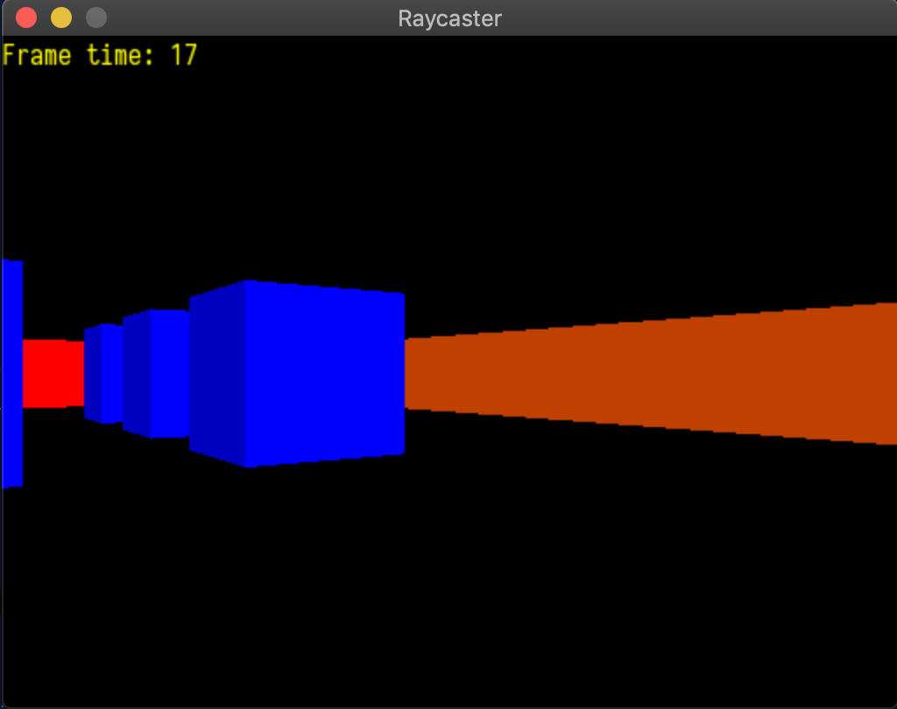

Links to other repos:

[Submission 1](https://l.messenger.com/l.php?u=https%3A%2F%2Fgithub.com%2Fmajid171%2FCOMP-3520-Final-Project&h=AT3qbcYDl2uslcWZ144tIf3x_JW1bvI4hL3yZVpkGwFn1UUOAYqLtBg6yg95NoElnf_VaFPRsZ5hUqeNENJ8AHkqc3xS_yBl9wSOU3u7xFxgZ47fEuodlMPdunKB-4z84S5ECgKG)

[Submission 2](https://github.com/rammom/COMP3520-FinalProject)


# Raycasting

At the very beginning of my Computer Graphics class I was very intrigued by the idea of raycasting.  Being able to immitate a 3D view in pure two dimentional space. This project is a product of my curiosity of raycasting, it is a 3D world redered in two dimentional space.

I do need to give credits to Shane for his SDL 2 code and cmake files are what I used as a base for this project. You can find his code and github profile here: [InBetweenNames](https://github.com/InBetweenNames/SDL2TemplateCMake.git)
   
## Contents

  - [Dependencies](##Dependencies)
  - [Project Setup](##Setup)
  - [Project Results](##Results)

## Dependencies

The dependencies of this project are:

* [SDL2](https://www.libsdl.org/download-2.0.php) - Barebones C++ graphics library
* [SDL2_ttf](https://www.libsdl.org/projects/SDL_ttf/) - Text library to go along with SDL2
* [cmake](https://cmake.org/) - Manages C++ build process

## Setup

Begin by cloning the project into a local directory on your machine

```sh
$ mkdir m_raycast && cd ./m_raycast
$ git clone https://github.com/rammom/raycast.git .
```

Build the project with cmake
```sh
$ cd build
$ cmake ..
$ cmake --build .
```

Run the project
```sh
$ ./main
```

## Results


